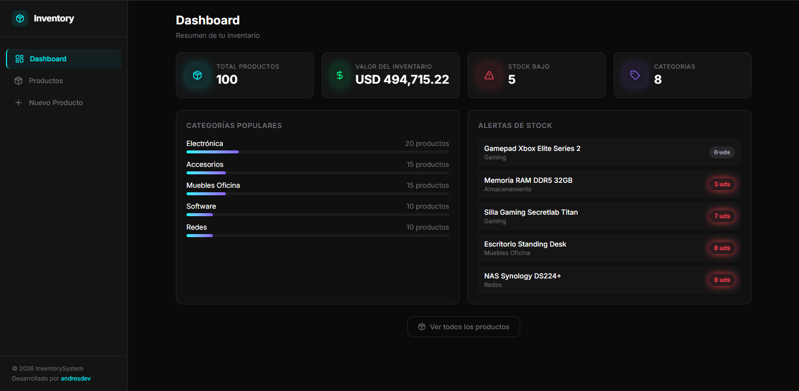

# Inventory System API

Sistema de gestión de inventario moderno y escalable construido con Spring Boot. Esta API RESTful proporciona operaciones CRUD completas para la gestión de productos.

## 🏗️ Arquitectura

El proyecto implementa una **arquitectura por feature** (orientada por características), organizando el código según las funcionalidades del sistema en lugar de tipos técnicos. Esta arquitectura favorece la escalabilidad y el mantenimiento del código.

### Estructura de directorios

```
src/main/java/com/andres/inventorysystemapi/
├── common/
│   └── entity/
│       └── BaseEntity.java          # Entidad base para todas las entidades
├── config/
│   └── ModelMapperConfig.java       # Configuración de ModelMapper
└── products/                        # Módulo de productos
    ├── controllers/
    │   ├── ProductController.java
    │   └── advice/
    │       └── ControllerAdvice.java
    ├── dto/
    │   ├── InProductDto.java       # DTO de entrada con validaciones
    │   ├── OutProductDto.java      # DTO de salida
    │   └── ErrorDto.java
    ├── exception/
    │   └── ResourceNotFoundException.java
    ├── mapper/
    │   └── ProductMapper.java      # Mapeo entre Entity y DTOs
    ├── model/
    │   └── Product.java            # Entidad de producto
    ├── repository/
    │   └── ProductRepository.java
    └── services/
        ├── IProductService.java
        └── ProductServiceImpl.java
```

## 🛠️ Tecnologías

| Tecnología              | Propósito                     |
| ----------------------- | ----------------------------- |
| **Java 21**             | Lenguaje de programación      |
| **Spring Boot 4.0.2**   | Framework principal           |
| **Spring Data JPA**     | Persistencia de datos         |
| **MySQL**               | Base de datos relacional      |
| **ModelMapper 3.2.4**   | Mapeo objeto-objeto           |
| **Lombok**              | Reducción de boilerplate      |
| **Jakarta Validation**  | Validaciones en DTOs          |
| **Hibernate Validator** | Validaciones en base de datos |

## 📸 Screenshots

| Vista          | Archivo                                                    | Descripción                         |
| -------------- | ---------------------------------------------------------- | ----------------------------------- |
| Landing        | [`assets/landing.png`](assets/landing.png)                 | Página de aterrizaje del sistema    |
| Dashboard      | [`assets/dashboard.png`](assets/dashboard.png)             | Panel principal con estadísticas    |
| Product List   | [`assets/product-list.png`](assets/product-list.png)       | Lista de productos con búsqueda     |
| Create Product | [`assets/create-producto.png`](assets/create-producto.png) | Formulario de creación de productos |

## Landing

## Dashboard


## Product List


## Create Product


## 📋 Características del Backend

### 1. Validaciones en DTOs (`InProductDto.java`)

Todas las validaciones se realizan en el nivel de DTO usando anotaciones de Jakarta Validation:

```java
public class InProductDto {
    @NotBlank(message = "Product name is required")
    @Size(min = 1, max = 100, message = "Product name must be between 1 and 100 characters")
    private String productName;

    @Size(max = 300, message = "Product description cannot exceed 300 characters")
    private String productDescription;

    @NotNull(message = "Product price is required")
    @Positive(message = "Product price must be greater than 0")
    @Digits(integer = 10, fraction = 2)
    private BigDecimal productPrice;

    @NotBlank(message = "Product category is required")
    private String productCategory;

    @NotNull(message = "Product stock is required")
    @PositiveOrZero(message = "Product stock cannot be negative")
    private Integer productStock;
}
```

**Validaciones implementadas:**

- `@NotBlank` - Campos de texto obligatorios
- `@Size` - Límites de longitud
- `@NotNull` - Campos no nulos
- `@Positive` - Valores mayores a 0
- `@PositiveOrZero` - Valores mayores o iguales a 0
- `@Digits` - Formato numérico específico

### 2. ModelMapper para DTOs

Configuración centralizada para el mapeo entre entidades y DTOs:

```java
@Configuration
public class ModelMapperConfig {
    @Bean
    public ModelMapper modelMapper() {
        return new ModelMapper();
    }
}
```

**Ventajas:**

- Conversión automática entre entidades y DTOs
- Reducción de código boilerplate
- Separación clara entre capas

### 3. BaseEntity para entidades

Todas las entidades heredan de `BaseEntity` para mantener campos comunes:

```java
@MappedSuperclass
public class BaseEntity implements Serializable {
    @Id
    @GeneratedValue(strategy = GenerationType.IDENTITY)
    private Long id;

    @CreationTimestamp
    @Column(updatable = false)
    private LocalDateTime createdAt;

    @UpdateTimestamp
    private LocalDateTime updatedAt;
}
```

**Campos incluidos:**

- `id` - Identificador único auto-generado
- `createdAt` - Fecha de creación (automático)
- `updatedAt` - Fecha de última actualización (automático)

### 4. Validaciones en Base de Datos (Entity)

Las validaciones a nivel de base de datos se definen en la entidad `Product`:

```java
@Entity
@Table(name = "products")
public class Product extends BaseEntity {
    @Column(length = 100, nullable = false)
    private String productName;

    @Column(length = 300, nullable = false)
    private String productDescription;

    @Column(nullable = false, precision = 10, scale = 2)
    private BigDecimal productPrice;

    @Column(length = 50, nullable = false)
    private String productCategory;

    @Column(nullable = false)
    private Integer productStock;
}
```

**Validaciones de BD:**

- `nullable = false` - Restricción NOT NULL
- `length` - Longitud máxima del campo
- `precision/scale` - Precisión decimal para precios

### 5. MySQL

Base de datos relacional configurada para persistencia de datos.

**Configuración requerida en `application.properties`:**

```properties
spring.datasource.url=jdbc:mysql://localhost:3306/inventory_system
spring.datasource.username=root
spring.datasource.password=your_password
spring.jpa.hibernate.ddl-auto=update
```

## 📡 Endpoints de la API

### Productos

| Método   | Endpoint             | Descripción                 |
| -------- | -------------------- | --------------------------- |
| `GET`    | `/api/products`      | Obtener todos los productos |
| `GET`    | `/api/products/{id}` | Obtener producto por ID     |
| `POST`   | `/api/products`      | Crear nuevo producto        |
| `PUT`    | `/api/products/{id}` | Actualizar producto         |
| `DELETE` | `/api/products/{id}` | Eliminar producto           |

### Ejemplo de solicitud POST

```json
POST /api/products
Content-Type: application/json

{
  "productName": "Laptop Dell",
  "productDescription": "Computadora portátil de alta gama",
  "productPrice": 1299.99,
  "productCategory": "Electronics",
  "productStock": 50
}
```

## 🚀 Instalación y Ejecución

### Prerrequisitos

- Java 21 o superior
- Maven 3.6+
- MySQL 8.0+

### Pasos

1. **Clonar el repositorio**

   ```bash
   git clone <repository-url>
   cd inventoryFullStack/InventorySystemAPI
   ```

2. **Configurar base de datos**
   - Crear base de datos MySQL
   - Actualizar `application.properties` con tus credenciales

3. **Ejecutar la aplicación**

   ```bash
   ./mvnw spring-boot:run
   ```

4. **Verificar**
   - La API estará disponible en `http://localhost:8080`
   - Documentación Swagger (si está configurada)

## 📁 Estructura del Proyecto

```
InventorySystemAPI/
├── src/
│   ├── main/
│   │   ├── java/com/andres/inventorysystemapi/
│   │   │   ├── InventorySystemApiApplication.java
│   │   │   ├── common/
│   │   │   ├── config/
│   │   │   └── products/
│   │   └── resources/
│   │       ├── application.properties
│   │       └── ...
│   └── test/
├── pom.xml
└── README.md
```

## 🔒 Manejo de Errores

El sistema incluye un `ControllerAdvice` para manejo centralizado de excepciones, devolviendo respuestas consistentes con códigos de error apropiados.

## 📝 Licencia

Este proyecto está bajo la Licencia MIT.
